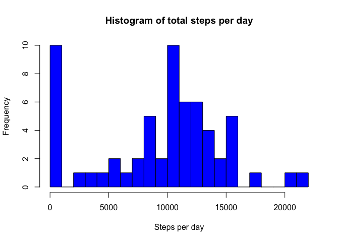
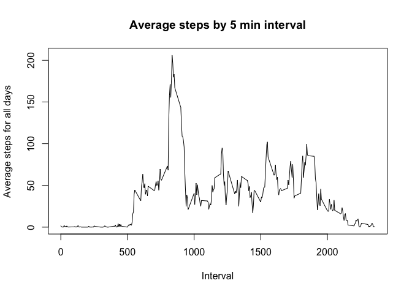
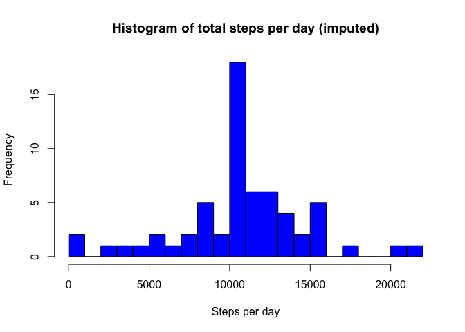
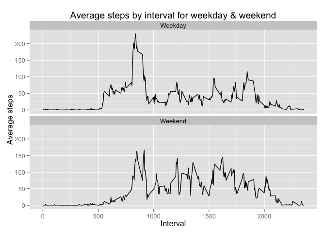

# Reproducible Research: Peer Assessment 1

This document contains the 1st assignment for the `Reproducible Research` course on Coursera.

The assignment is to analyze data collected from a personal activity monitoring device (like FitBit) and describe the steps in a R markdown format. The activity data contains the number of steps in 5 minute intervals.

See the [full details here for the assignment](README.md).

## Loading and preprocessing the data

The activity data is located in a zip file in the current directory.


```r
unzip("activity.zip")
activity <- read.csv("activity.csv")
```

Here's a short description of the data:


```r
str(activity)
```

```
## 'data.frame':	17568 obs. of  3 variables:
##  $ steps   : int  NA NA NA NA NA NA NA NA NA NA ...
##  $ date    : Factor w/ 61 levels "2012-10-01","2012-10-02",..: 1 1 1 1 1 1 1 1 1 1 ...
##  $ interval: int  0 5 10 15 20 25 30 35 40 45 ...
```

```r
head(activity)
```

```
##   steps       date interval
## 1    NA 2012-10-01        0
## 2    NA 2012-10-01        5
## 3    NA 2012-10-01       10
## 4    NA 2012-10-01       15
## 5    NA 2012-10-01       20
## 6    NA 2012-10-01       25
```

## What is mean total number of steps taken per day?

1. Make a histogram of the total number of steps taken each day

Missing values are ignored.


```r
# aggregate steps / day
#activity.date <- aggregate(steps ~ date, data=activity, FUN=sum, na.rm=TRUE)
activity.date <- aggregate(activity[1], by=activity[2], FUN=sum, na.rm=TRUE)

# draw histogram
hist(activity.date$steps,
     breaks=20,
     col="blue",
     main="Histogram of total steps per day",
     xlab = "Steps per day")
```

 

2. Calculate and report the mean and median total number of steps taken per day


```r
mean(activity.date$steps)
```

```
## [1] 9354.23
```

```r
median(activity.date$steps)
```

```
## [1] 10395
```

## What is the average daily activity pattern?

1. Make a time series plot (i.e. type = "l") of the 5-minute interval (x-axis) and the average number of steps taken, averaged across all days (y-axis)


```r
activity.interval <- aggregate(activity[1], by=activity[3], FUN=mean, na.rm=TRUE)
plot(activity.interval,
     type="l",
     main="Average steps by 5 min interval",
     ylab="Average steps for all days",
     xlab="Interval")
```

 

2. Which 5-minute interval, on average across all the days in the dataset, contains the maximum number of steps?


```r
activity.interval$interval[which.max(activity.interval$steps)]
```

```
## [1] 835
```

## Imputing missing values

1. Calculate and report the total number of missing values in the dataset (i.e. the total number of rows with NAs)


```r
sum(is.na(activity$steps))
```

```
## [1] 2304
```

2. Devise a strategy for filling in all of the missing values in the dataset. The strategy does not need to be sophisticated. For example, you could use the mean/median for that day, or the mean for that 5-minute interval, etc.

I think it makes sense to use the mean for the 5 min interval the value is missing for.

3. Create a new dataset that is equal to the original dataset but with the missing data filled in.


```r
activity <- merge(activity, activity.interval, by="interval", suffixes=c("", ".mean"))
nas <- is.na(activity$steps)
activity$steps[nas] <- activity$steps.mean[nas]
activity <- activity[,c(1:3)]
```

4. Make a histogram of the total number of steps taken each day and Calculate and report the mean and median total number of steps taken per day. Do these values differ from the estimates from the first part of the assignment? What is the impact of imputing missing data on the estimates of the total daily number of steps?


```r
activity.date <- aggregate(activity[2], by=activity[3], FUN=sum, na.rm=TRUE)
hist(activity.date$steps,
     breaks=20,
     col="blue",
     main="Histogram of total steps per day (imputed)",
     xlab = "Steps per day")
```

 

```r
mean(activity.date$steps)
```

```
## [1] 10766.19
```

```r
median(activity.date$steps)
```

```
## [1] 10766.19
```

**Answer to question:**
The impact of imputing missing data has increased the mean & median to the same value, which makes sense as missing values has been replaced by the mean in the interval.

## Are there differences in activity patterns between weekdays and weekends?

1. Create a new factor variable in the dataset with two levels – “weekday” and “weekend” indicating whether a given date is a weekday or weekend day.


```r
activity$date <- as.POSIXlt(activity$date, format="%Y-%m-%d")
activity$daytype <- "Weekday"
activity$daytype[weekdays(activity$date) %in% c("Saturday","Sunday")] <- "Weekend"
```

2. Make a panel plot containing a time series plot (i.e. type = "l") of the 5-minute interval (x-axis) and the average number of steps taken, averaged across all weekday days or weekend days (y-axis). See the README file in the GitHub repository to see an example of what this plot should look like using simulated data.


```r
activity.interval <- aggregate(activity[2],
                                by=activity[c(1,4)],
                                FUN=mean,
                                na.rm=TRUE)

library(ggplot2)
plot <- ggplot(data = activity.interval, aes(x=interval, y=steps))
plot +
geom_line() +
ggtitle("Average steps by interval for weekday & weekend") +
ylab("Average steps") +
xlab("Interval") +
facet_wrap(~daytype, nrow=2)
```

 

**Answer to question:**

In the plot above we can see higher activity in the morning for weekdays compared to the weekend and higher activity in the afternoon during the weekend compared to weekdays.
